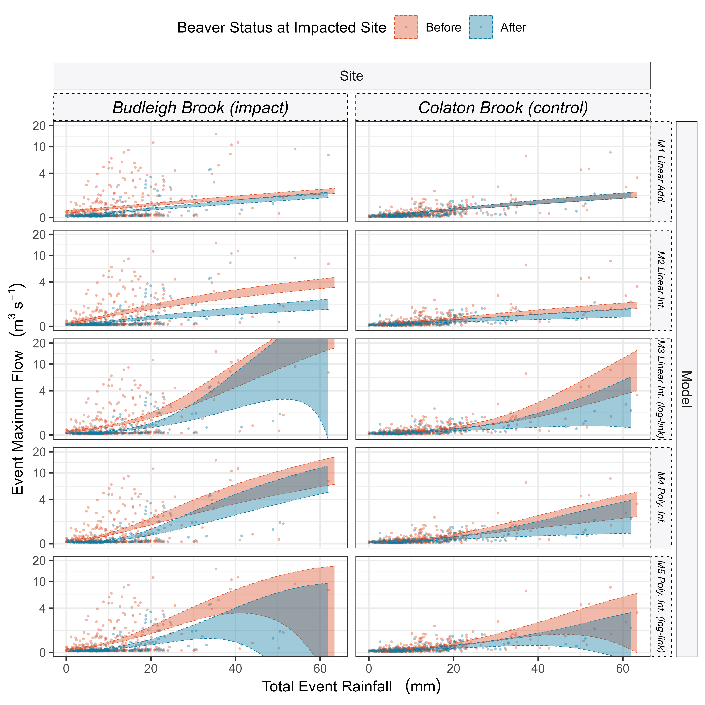
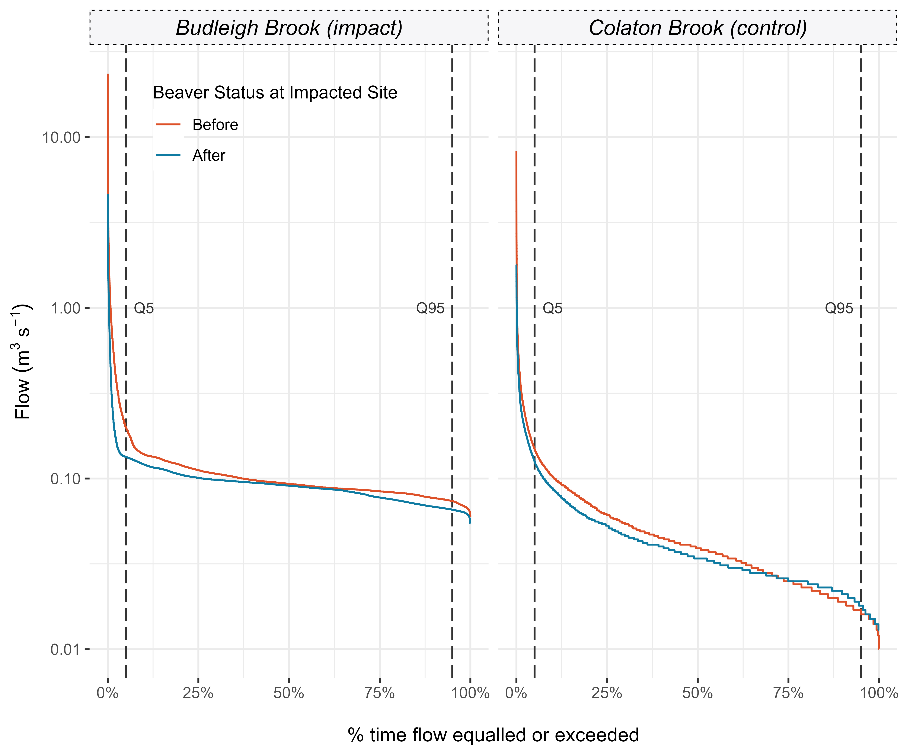

# East Budleigh Hydrological Analysis

Data analysis for [Puttock, et al. (2021)](https://doi.org/10.1002/hyp.14017)
and Graham, et al. (In Review).

Workflow for the processing and analysis of hydrological data from East
Budleigh EA gaug to evaluate the imapcts of Beaver on Flow regimes...

And here's the rough result...  Location of
Budeligh brook Catchment Colaton Brook catchemnts, gauging station and
Beaver dam sequence.

 All
events overlain including fitted General Additive Models (GAM). Used to
estimate and compare changes in hydrological event geometry pre/post
beaver.

Range of GLMs to investigate flow attenuation mechanism. M4/M5 are
comparable and perform best; M5 model residuals indicate less deviance
in residuals for larger events and therefore offering more reliable
predictions for these key larger events. Attenuation increases up to a
point - after which we cannot be confident in observing significant
differences between factor levels (beaver presence/absence).

Predicted attenuation increases up to 94th percenile of event total
rainfall. beyond the 97th percetile there is a large increase in our
prediction uncertainties.

Flow duration curves for Budleigh Brook and Colaton Brook
