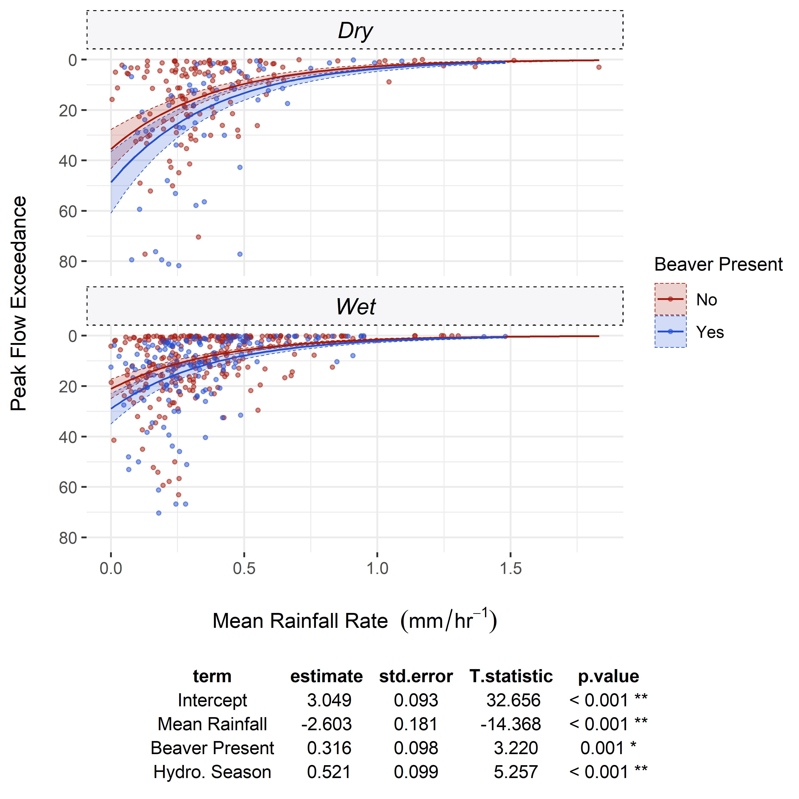
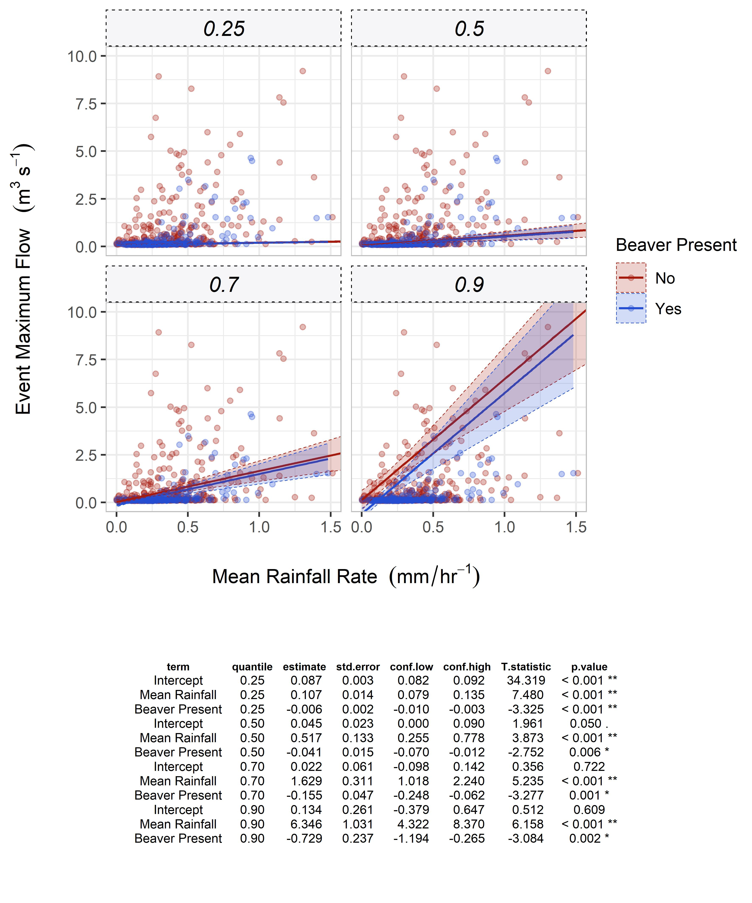

# East Budleigh Hydrological Analysis

Workflow for the processing and analysis of hydrological data from East Budleigh EA gaug to evaluate the imapcts of Beaver on Flow regimes...

And here's the rough result...
 
Location of Budeligh brook catchemnt, gauging station and Beaver dam sequence.

  
GLM showing peak flow attenuation for events with peak flow of magnitude greater than Q2  

GLM for all events showing change in peak flow exceedance limit across Hydrological season.

Quantile regression for all events across different tau values - indicating greater attenuation at higher flows.