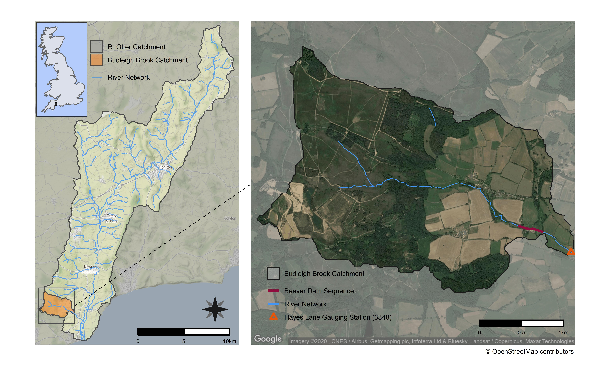
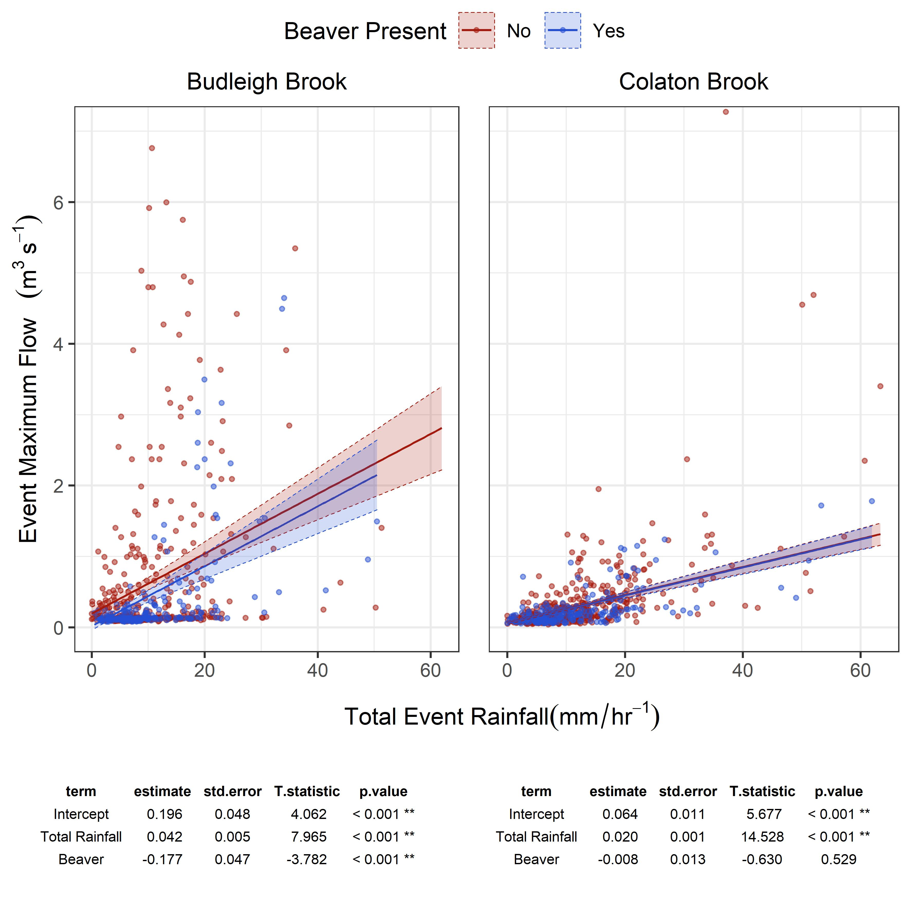

# East Budleigh Hydrological Analysis

Workflow for the processing and analysis of hydrological data from East Budleigh EA gaug to evaluate the imapcts of Beaver on Flow regimes...

And here's the rough result...
 
Location of Budeligh brook catchemnt, gauging station and Beaver dam sequence.

  
GLM showing flow attenuation post beaver when compared with control catchment. 

GLM with Hydrological season as covariate. Shows attenuation occurs to a greater extent during the wet season

GLM fitted to subset of data where flow is larger than Q5 (i.e >95th percentile). Shows that attenuation persists even at high flows.